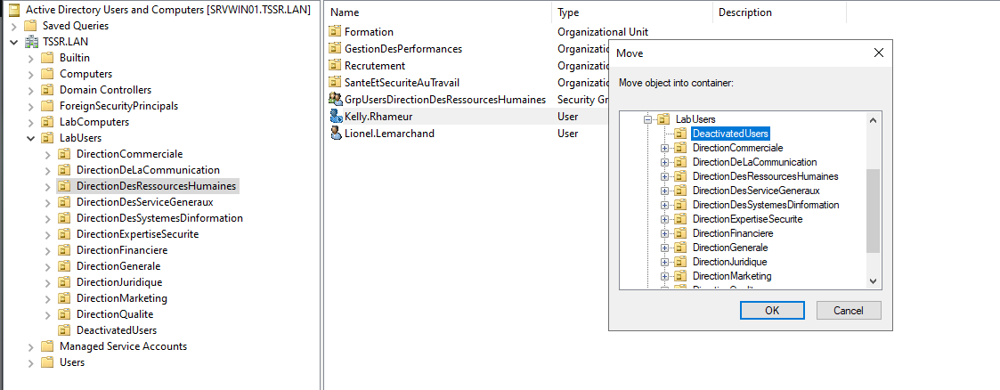
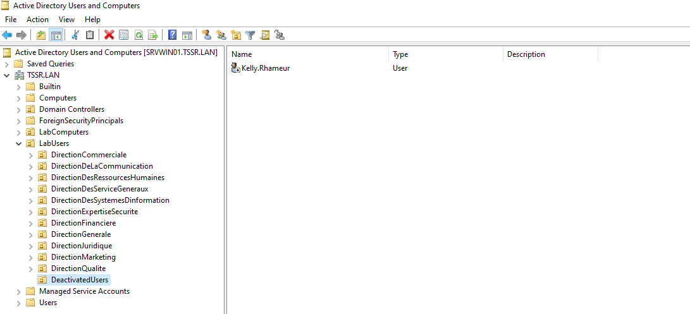

# Exercice 1 : Manipulations pratiques sur VM Windows 

## Partie 1 : Gestion des utilisateurs

*L'utilisateur Kelly Rhameur a quitté l'entreprise.Elle est remplacée par Lionel Lemarchand*

Q.1.1.1 Créer l'utilisateur Lionel Lemarchand avec les même attribut de société que Kelly Rhameur.
  

 

 

Q.1.1.2 Créer une OU DeactivatedUsers et déplace le compte désactivé de Kelly Rhameur dedans.

 

 

 

Q.1.1.3 Modifier le groupe de l'OU dans laquelle était Kelly Rhameur en conséquence.

  

Q.1.1.4 Créer le dossier Individuel du nouvel utilisateur et archive celui de Kelly Rhameur en le suffixant par -ARCHIVE.

  

 

## Partie 2 : Restriction utilisateurs

Q.1.2.1 Faire en sorte que l'utilisateur Gabriel Ghul ne puisse se connecter que du lundi au vendredi, de 7h à 17h.

Q.1.2.2 De même, bloquer sa connexion au seul ordinateur CLIENT01.

Q.1.2.3 Mettre en place une stratégie de mot de passe pour durcir les comptes des utilisateurs de l'OU LabUsers.

## Partie 3 : Lecteurs réseaux

Q.1.3.1 Créer une GPO Drive-Mount qui monte les lecteurs E: et F: sur les clients.

