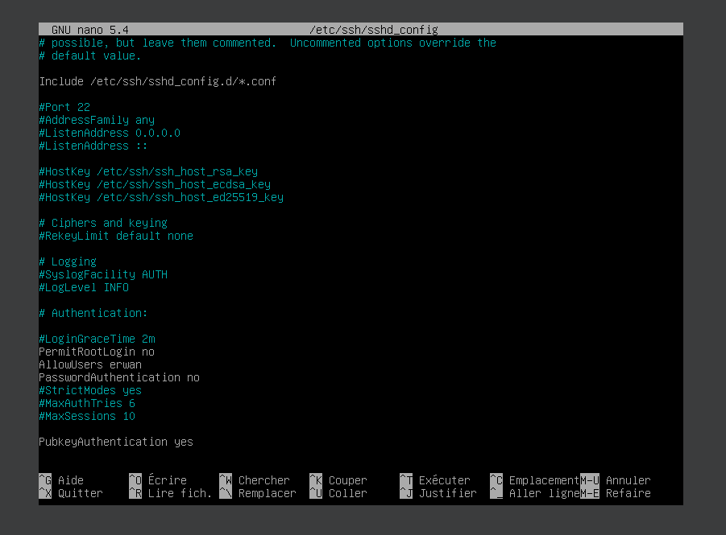

# Exercice 2 : Manipulations pratiques sur VM Linux

## Partie 1 : Gestion des utilisateurs

Q.2.1.1 Sur le serveur, créer un compte pour ton usage personnel.


Q.2.1.2 Quelles préconisations proposes-tu concernant ce compte ?

Je recommande de ne garder que les permissions par défaut, pour éviter de réaliser des actions malveillantes/destructrices. 
Il faut également s'assurer de changer régulièrement de mot de passe et ne pas permettre de connexion via ssh sur ce compte, il faut plutôt créer un compte dédié à la connexion à distance. 

## Partie 2 : Configuration de SSH

*Un serveur SSH est lancé sur le port par défaut.
Il est possible de s'y connecter avec n'importe quel compte, y compris le compte root.*

Q.2.2.1 Désactiver complètement l'accès à distance de l'utilisateur root.su 


Q.2.2.2 Autoriser l'accès à distance à ton compte personnel uniquement.


Q.2.2.3 Mettre en place une authentification par clé valide et désactiver l'authentification par mot de passe



## Partie 3 : Analyse du stockage

Q.2.3.1 Quels sont les systèmes de fichiers actuellement montés ?

En réalisant la commande `cat /etc/fstab` je vois qu'il y a les systèmes de fichiers suivants : ext4 ; ext2 et swap  

Q.2.3.2 Quel type de système de stockage ils utilisent ?

En faisant `lsblk` pour comprendre l'architecture puis `lsblk /dev/md0`, je comprends que l'unique partition est montée en RAID1.

Q.2.3.3 Ajouter un nouveau disque de 8,00 Gio au serveur et réparer le volume RAID

Ajout d'un disque de 8G via VirtualBox. 

```
# vérification de /dev/md0
mdadm -D /dev/dm0

# La ligne 'State : clean degraded' indique qu'il y a un problème car le RAID fonctionne en dégradé. Il n'y a qu'un seul disque sur les deux nécessaires (cf ligne Active Device :1) 
# Partionnement du nouveau disque pour l'ajouter à /dev/md0
fdisk /dev/sdb
# Nouvelle partition 'n' puis  paramètres par défaut 
n
# 'p' pour primaire
p
# 't' pour formater la partition
t
# type de partition RAID avec l'id de type 'FD'
FD
# écriture de la table avec 'w'
w
q

#commande lsblk pour vérifier que le partionnement est bon
lsblk /dev/sdb

# Ajout du disque /dev/sdb1 au RAID /dev/md0
mdadm --manage /dev/md0 --add /dev/sdb1

# Verification de l'état du RAID
mdadm -D /dev/dm0
# Le state est Clean donc réparé
```


Q.2.3.4 Ajouter un nouveau volume logique LVM de 2 Gio qui servira à héberger des sauvegardes. Ce volume doit être monté automatiquement à chaque démarrage dans l'emplacement par défaut : /var/lib/bareos/storage.
```
# on cherche le nom du volume group à partir duquel crée le LV
vgdisplay
# le vg "cp3-vg" va être utilisé pour créer le volume logique de 2G
lvcreate -n "sauvegardes" -L 2G cp3-vg

# vérification des différents lvs
lvdisplay

# on met un système de fichier sur le LV
mkfs -t ext4 /dev/cp3-vg/sauvegardes

# Montage sur /var/lib/bareos/storage
mount /dev/cp3-vg/sauvegardes /var/lib/bareos/storage

# récupération de l'UUID
lvdisplay /dev/cp3-vg/sauvegardes | grep "LV UUID" >> /etc/fstab

#Montage en auto dans le fichier /etc/fstab  avec la ligne suivante 
UUID=j1ASJQ-QBRg-fy0B-W4Zk-qR36-MqAt-1jQVCG /var/lib/bareos/storage ext4 defaults 0 0
```

Q.2.3.5 Combien d'espace disponible reste-t-il dans le groupe de volume ?


## Partie 4 : Sauvegardes

Le logiciel bareos est installé sur le serveur.
Les composants bareos-dir, bareos-sd et bareos-fd sont installés avec une configuration par défaut.

Q.2.4.1 Expliquer succinctement les rôles respectifs des 3 composants bareos installés sur la VM.

## Partie 5 : Filtrage et analyse réseau

Q.2.5.1 Quelles sont actuellement les règles appliquées sur Netfilter ?

Les règles appliquées sont les suivantes pour des flux entrants : 
- accepte les paquets de connections connues
- drop les paquets entrants des autres connections
- Accepte les connections sur son addresse de loopback
- Accepte les connections tcp sur le port 22
- Accepte les paquets ICMP (ping)
- Accepte les ping en ipv6

Q.2.5.2 Quels types de communications sont autorisées ?

Les communications autorisées sont les pings ipv4 et ipv6, les communications via protocole TCP sur le port 22, et les communications venant de l'interface loopback. 

Q.2.5.3 Quels types sont interdit ?

Les communications de l'extérieur sont toutes interdites  sauf celles citées à la Q.2.5.2,  

Q.2.5.4 Sur nftables, ajouter les règles nécessaires pour autoriser bareos à communiquer avec les clients bareos potentiellement présents sur l'ensemble des machines du réseau local sur lequel se trouve le serveur.


## Partie 6 : Analyse de logs

Q.2.6.1 Lister les 10 derniers échecs de connexion ayant eu lieu sur le serveur en indiquant pour chacun :

La commande ` journalctl -r -g "rhost="` donne le tableau suivant

| Timestamp         | IP                                   |
|-------------------|--------------------------------------|
| Janv. 17 10:59:24 | X                                    |
| déc. 21 14:39:27  | X                                    |
| déc. 21 14:12:30  | X                                    |
| Janv. 03 12:09:37 | fd26:ba41:c8d6:0:ba92:6393:cc55:8b8d |
| Janv. 03 12:09:26 | fd26:ba41:c8d6:0:ba92:6393:cc55:8b8d |
| Janv. 03 11:23:45 | 10.0.0.199                           |
| Janv. 03 11:23:31 | 10.0.0.199                           |
| Janv. 03 11:23:00 | 10.0.0.199                           |
| Janv. 03 11:06:43 | 10.0.0.199                           |
| Janv. 03 11:06:28 | 10.0.0.199                           |


